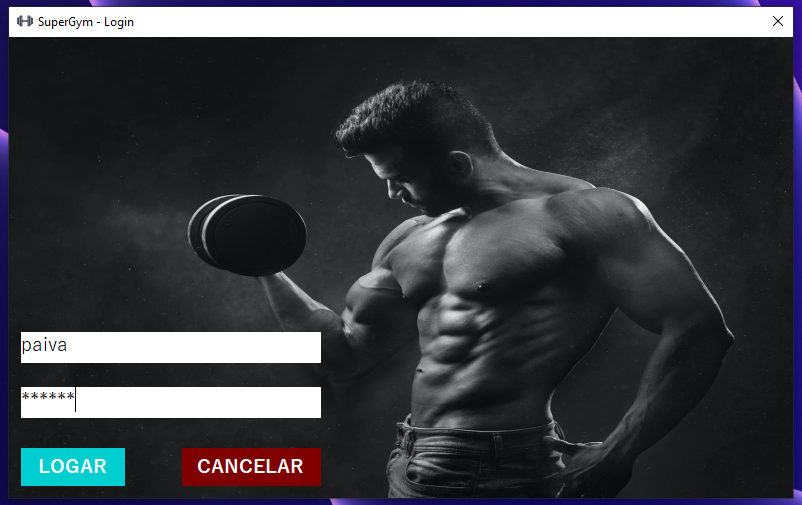

<h1>SuperGym</h1>

  

    Application to manage your gym

 <a href="#status">Status</a> • 
 <a href="#objective">Objective</a> •
 <a href="#installation">Installation</a> • 
 <a href="#technology">Technology</a> • 
 <a href="#author">Author</a> • 
 <a href="#licence">License</a>

<h2 align="center" id=status> 
	✔️ in progress ✔️
</h2>

<h2 id=objective>:scroll: Objective</h2>

The goal is to use the C# language to build an application to manage your gym.

<h2 id=installation>:clipboard: Installation</h2>

1. Download the repository

<h2 id=technology>:toolbox: Technology</h2>
The following tools were used in the construction of the project:

- IDE: <a href="https://visualstudio.microsoft.com/pt-br/vs/">Visual Studio 2019</a>
- Database: <a href="https://www.sqlite.org/index.html">SQLite</a>
- SGBD: <a href="https://go.microsoft.com/fwlink/?linkid=2163435">SQLite Studio</a>
- Styles: <a href="https://www.iconfinder.com/">IconFinder</a> | <a href="https://www.pexels.com/pt-br/">Pexels</a>
- Requirement SDK: <a href="https://dotnet.microsoft.com/download/dotnet/5.0">.Net 5</a>
- Lib: system.data.sqlite

<h2 id=author>:grin: Author</h2>
Developed by <a href="https://www.linkedin.com/in/danhpaiva/">Daniel Paiva</a>

<h2 id=licence>:lock: Licence</h2>
<a href="https://github.com/danhpaiva/superGym-chsarp/blob/main/LICENSE" target="_blank">MIT</a>
